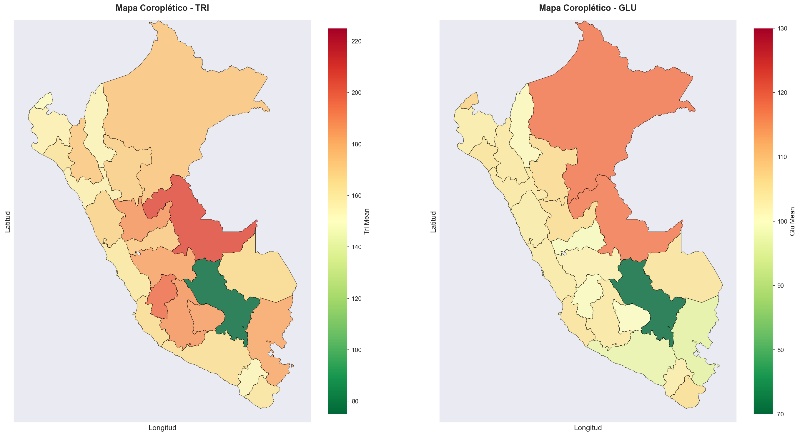
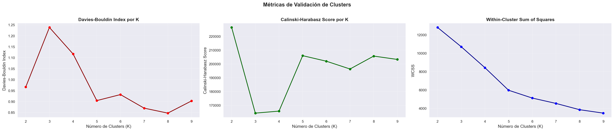
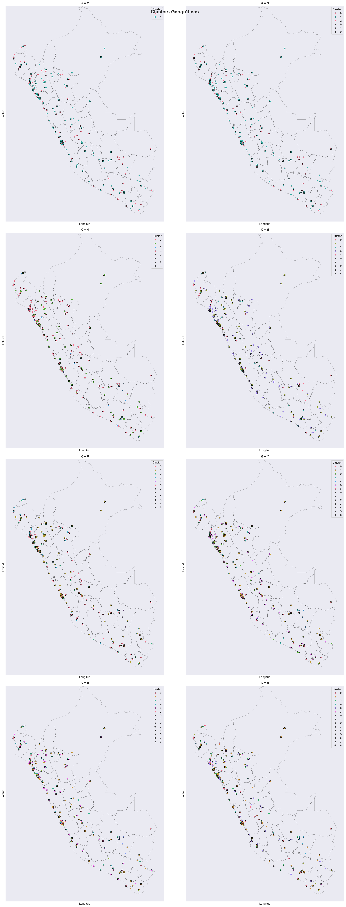
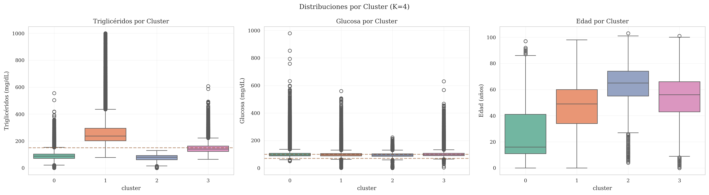
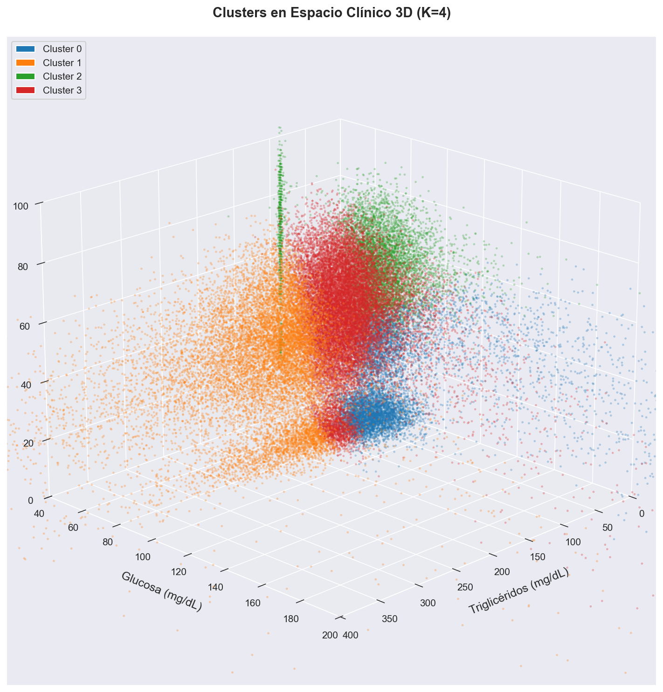
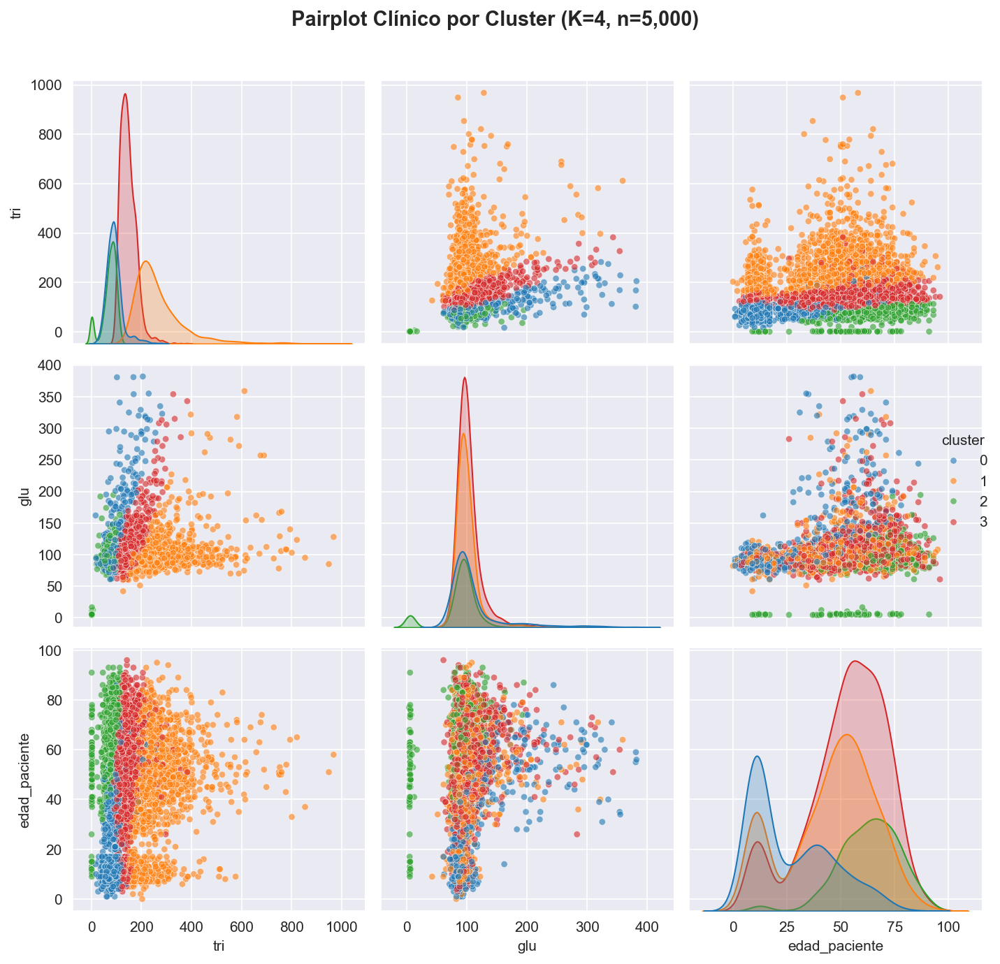
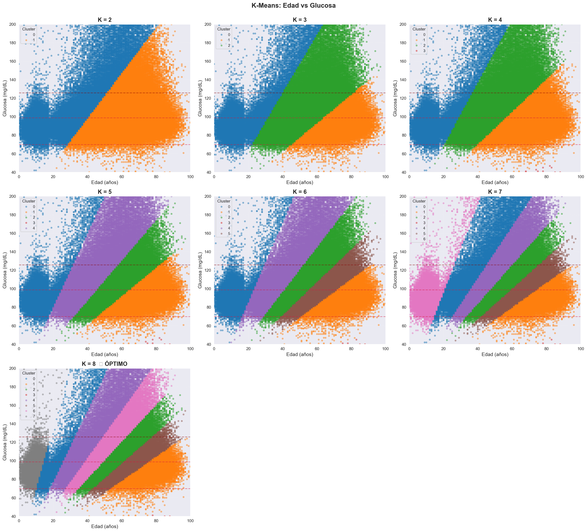
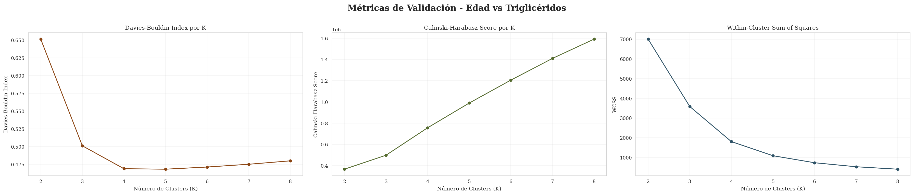
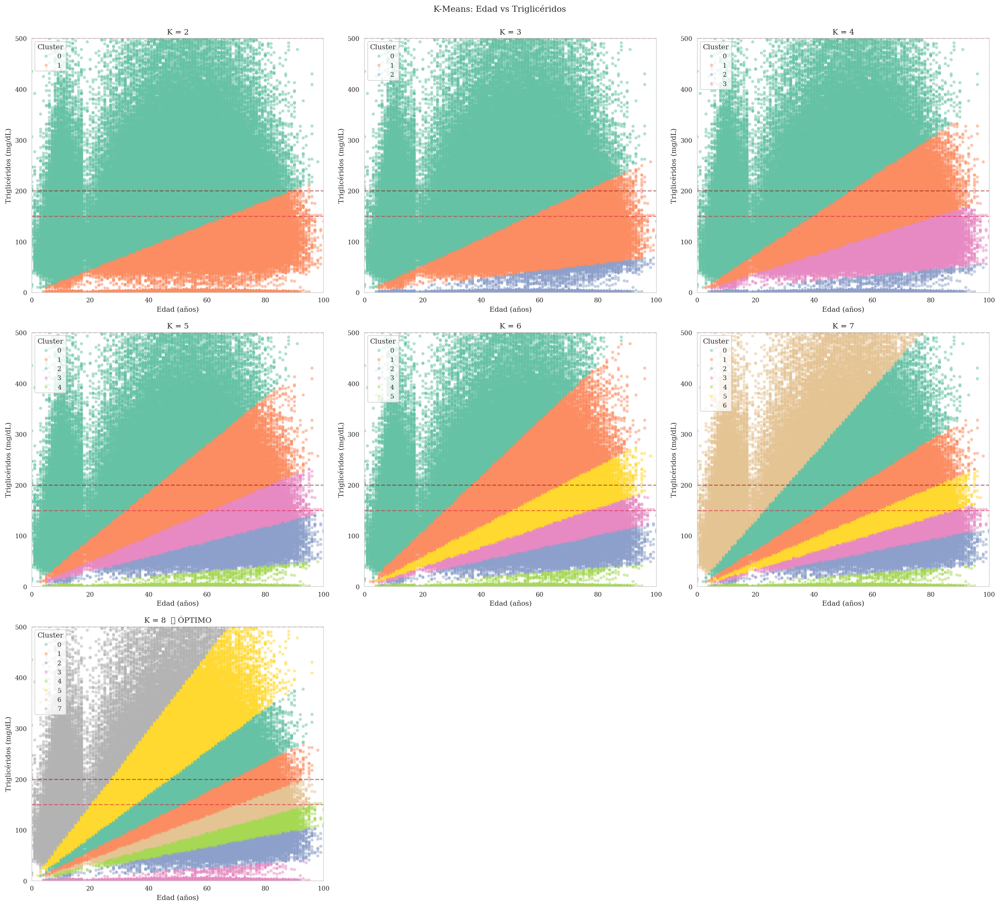

# Identificación de Perfiles Metabólicos en Pacientes con Obesidad mediante K-Means Clustering

Análisis de agrupamiento no supervisado para caracterizar perfiles clínicos en 294,971 exámenes de laboratorio de pacientes diagnosticados con obesidad y condiciones metabólicas relacionadas (EsSalud Perú, 2020-2024).

## Dataset

- **Registros**: 294,971 exámenes de laboratorio (entrenamiento: enero 2020 - abril 2024)
- **Variables**: Triglicéridos, glucosa, edad, ubicación geográfica (latitud, longitud)
- **Población**: Pacientes diagnosticados con condiciones relacionadas a obesidad (códigos ICD-10/CIE-10)
- **Fuente**: [EsSalud Open Data - Exámenes de Laboratorio de Consulta Externa](https://www.datosabiertos.gob.pe/dataset/ex%C3%A1menes-de-laboratorio-de-consulta-externa-de-pacientes-diagnosticados-con-patolog%C3%ADas-3) (Plataforma Nacional de Datos Abiertos, Gobierno del Perú)

## Distribución Geográfica



Promedios de triglicéridos y glucosa por departamento del Perú. Los mapas coropléticos revelan heterogeneidad espacial en factores metabólicos, útil para focalización territorial de intervenciones.

---

## Análisis 1: K-Means 5D (Triglicéridos + Glucosa + Edad + Ubicación)

**Variables**: `tri`, `glu`, `edad_paciente`, `latitude`, `longitude`
**K evaluados**: 2-9

### Métricas de Validación



**Resultados**:
- **Davies-Bouldin**: K=8 (óptimo, menor dispersión interna)
- **Calinski-Harabasz**: K=2 (óptimo, máxima separación)
- **WCSS (Método del codo)**: K=4-5 (óptimo, por inspección visual del punto de inflexión) ⭐

**K seleccionado**: K=4 (consenso entre método del codo y simplicidad interpretativa)

El desacuerdo entre métricas refleja la complejidad multidimensional del fenotipo metabólico en obesidad. El método del codo indica 4-5 clusters como estructura principal, evitando sobresegmentación.

### Visualizaciones

#### Clusters Geográficos (K=2-5)



Distribución espacial de clusters en el territorio peruano. Cada valor de K muestra diferente granularidad en la segmentación geográfica-metabólica.

#### Espacio Clínico: Triglicéridos vs Glucosa (K=2-5)


Proyección de clusters 5D en espacio bidimensional tri-glu. Las líneas rojas marcan umbrales clínicos (tri=150 mg/dL, glu=70-99 mg/dL).

#### Caracterización de Clusters (K=4)



Distribuciones de triglicéridos, glucosa y edad por cluster (K=4 seleccionado para análisis exploratorio).

**Perfiles identificados (K=4)**:
- **Cluster 0**: Jóvenes (26.4 años), tri bajo (91 mg/dL), glu elevada (115 mg/dL)
- **Cluster 1**: Adultos (45.6 años), dislipidemia severa (tri=265 mg/dL), glu normal (100 mg/dL)
- **Cluster 2**: Adultos mayores (63.9 años), perfil metabólico favorable (tri=73, glu=88 mg/dL)
- **Cluster 3**: Adultos (53.1 años), perfil intermedio (tri=146, glu=103 mg/dL)

#### Visualización 3D



Espacio clínico tridimensional: Triglicéridos (X), Glucosa (Y), Edad (Z). Muestra estratificada (n=50,000).

#### Pairplot de Variables Clínicas (K=4)



Matriz de dispersión bivariada (tri, glu, edad) coloreada por cluster. Muestra n=5,000.

---

## Análisis 2: K-Means 2D Edad vs Glucosa

**Variables**: `edad_paciente`, `glu`
**K evaluados**: 2-8

### Métricas de Validación


**Resultados**:
- **Davies-Bouldin**: K=4 (óptimo, menor dispersión interna)
- **Calinski-Harabasz**: K=8 (óptimo, máxima separación)
- **WCSS (Método del codo)**: K=4 (óptimo, por inspección visual del punto de inflexión) ⭐

**K seleccionado**: K=4 (consenso entre Davies-Bouldin y método del codo) ⭐

El método del codo y Davies-Bouldin convergen en K=4, identificando cuatro perfiles etario-glucémicos principales sin sobresegmentación.

### Clusters Identificados (K=2-8)



Segmentación por grupo etario y estado glucémico. Las líneas rojas marcan umbrales clínicos (normal: 70-99 mg/dL, prediabetes: 100-125 mg/dL, diabetes: ≥126 mg/dL).

### Interpretación según K Seleccionado

**K=4 (método del codo)** identifica cuatro perfiles etario-glucémicos principales:

**Hallazgos generales** (observados en K=2-8):
- **Población pediátrica y adolescente**: Control glucémico mayormente normal (90-100 mg/dL).
- **Adultos jóvenes** (20-40 años): Deterioro glucémico temprano con valores elevados (110-130 mg/dL), indicando prediabetes.
- **Mediana edad** (40-60 años): Predominio de prediabetes (100-110 mg/dL).
- **Adultos mayores** (>65 años): Perfil heterogéneo con subgrupos de glucosa normal y elevada.

**Nota metodológica**: La gráfica K=2-8 muestra la evolución de la segmentación. K=4 captura las cuatro estructuras principales sin sobresegmentar. K=8 (sugerido por Calinski-Harabasz) representa subdivisiones granulares dentro de estos 4 grupos.

---

## Análisis 3: K-Means 2D Edad vs Triglicéridos

**Variables**: `edad_paciente`, `tri`
**K evaluados**: 2-8

### Métricas de Validación



**Resultados**:
- **Davies-Bouldin**: K=5 (óptimo, menor dispersión interna)
- **Calinski-Harabasz**: K=8 (óptimo, máxima separación)
- **WCSS (Método del codo)**: K=3 (óptimo, por inspección visual del punto de inflexión) ⭐

**K seleccionado**: K=3 (método del codo) ⭐

El método del codo indica K=3 como estructura principal, identificando tres grupos etarios con perfiles lipídicos diferenciados. Valores mayores (K=5-8) representan subsegmentaciones granulares.

### Clusters Identificados (K=2-8)



Segmentación por edad y perfil lipídico. Las líneas rojas marcan umbrales clínicos (normal: <150 mg/dL, límite alto: 150-199 mg/dL, alto: 200-499 mg/dL, muy alto: ≥500 mg/dL).

### Perfiles Edad-Triglicéridos (K=8)

| Cluster | n | Edad (años) | Triglicéridos (mg/dL) | Estado Lipídico |
|---------|---|-------------|-----------------------|-----------------|
| 0 | 58,158 | 50.9 | 177.4 | Límite alto |
| 1 | 52,800 | 56.7 | 141.7 | Normal |
| 2 | 9,592 | 70.8 | 63.5 | Normal |
| 3 | 4,183 | 52.4 | 3.3 | Normal (atípico) |
| 4 | 25,386 | 65.9 | 89.1 | Normal |
| 5 | 54,349 | 39.7 | 213.9 | Alto ⚠️ |
| 6 | 40,388 | 61.4 | 113.7 | Normal |
| 7 | 50,115 | 17.8 | 212.8 | Alto ⚠️ |

**Hallazgos clave**:
- **Dislipidemia en población joven**: Clusters 5 (39.7 años) y 7 (17.8 años) presentan triglicéridos elevados (213-214 mg/dL), indicando necesidad de intervención temprana.
- **Adultos mayores con perfil favorable**: Clusters 2, 4, 6 (61-71 años) exhiben triglicéridos normales o límite (63-114 mg/dL).
- **Patrón invertido**: Jóvenes con peor perfil lipídico que adultos mayores sugiere cambios generacionales en estilos de vida.

---

## Conclusiones

### 1. Heterogeneidad de Perfiles Metabólicos

El análisis K-means 5D reveló complejidad estructural en el fenotipo metabólico de obesidad. Las métricas de validación mostraron discordancia (Calinski-Harabasz: K=2, Davies-Bouldin: K=8, WCSS: K=4-5), reflejando coexistencia de perfiles discretos y gradientes continuos de severidad metabólica. **El método del codo indica K=4-5 como estructura principal** clínicamente interpretable.

### 2. Estratificación Edad-Glucosa: 4 Perfiles Principales

El clustering edad-glucosa mostró consenso metodológico: **Davies-Bouldin y el método del codo convergen en K=4**, identificando cuatro perfiles etario-glucémicos principales sin sobresegmentación. Calinski-Harabasz sugiere K=8, pero representa subsegmentaciones granulares de estos 4 grupos base.

### 3. Dislipidemia por Edad: Estructura Tripartita

El análisis edad-triglicéridos reveló **K=3 según método del codo**, identificando tres grupos etarios con perfiles lipídicos diferenciados:
- **Jóvenes**: Hipertrigliceridemia (>200 mg/dL)
- **Mediana edad**: Perfil intermedio (140-180 mg/dL)
- **Adultos mayores**: Perfil favorable (<140 mg/dL)

Este patrón invertido (jóvenes con peor perfil lipídico) sugiere cambios generacionales en estilos de vida que requieren intervención preventiva temprana.

### 4. Variabilidad Geográfica de Factores Metabólicos

Los mapas coropléticos revelaron heterogeneidad espacial en triglicéridos y glucosa entre departamentos del Perú, permitiendo focalización territorial de programas de intervención en obesidad y síndrome metabólico.

### 5. Consideraciones Metodológicas: Prioridad del Método del Codo

El desacuerdo sistemático entre métricas es característico de datos clínicos con estructuras no esféricas:
- **Davies-Bouldin** (minimizar): Favorece K intermedios, penaliza dispersión interna
- **Calinski-Harabasz** (maximizar): Tiende a sobreestimar K en gradientes continuos
- **WCSS (método del codo)** (inspección visual): Más interpretable y clínicamente relevante

**Recomendación**: Priorizar el método del codo cuando hay punto de inflexión claro, resultando en:
- **5D**: K=4-5 perfiles metabólico-geográficos
- **Edad-Glucosa**: K=4 grupos etario-glucémicos
- **Edad-Triglicéridos**: K=3 perfiles etario-lipídicos

Estas estructuras evitan sobresegmentación y facilitan traducción a intervenciones de salud pública.

---

## Estructura del Proyecto

```
├── src/                    # Módulos Python
│   ├── clustering.py       # K-means, métricas, visualización
│   ├── data_processing.py  # Features, normalización
│   └── geo_viz_*.py        # Mapas geográficos (base, choropleth, clusters)
├── nb/k_means.ipynb        # Análisis principal
├── data/                   # Datasets
│   ├── dataset_202001_202404_training.csv  # 294K registros
│   ├── ubigeo_distrito.csv                 # Coordenadas geográficas
│   └── peru_departamental.geojson          # Límites departamentales
└── images/                 # Figuras generadas
```

## Uso

```bash
uv sync
jupyter lab nb/k_means.ipynb
```

**Generar imágenes**: Las imágenes se guardan automáticamente en `images/` al ejecutar cada celda de visualización del notebook.